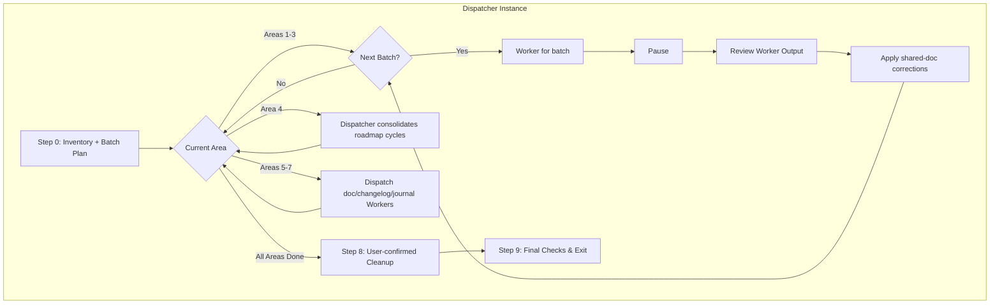

# Cline Recursive Chain-of-Thought System (CRCT) - Cleanup/Consolidation Plugin (Dispatcher Focus)

This Plugin provides detailed instructions and procedures for the Dispatcher role within
the Cleanup/Consolidation phase. The Dispatcher orchestrates comprehensive verification
and consolidation by delegating batched review work to fresh Worker instances
(`cleanup_consolidation_worker_plugin.md`), then performs integration and user-interactive
cleanup itself.

## Core Concept (Dispatcher Perspective)

- The primary instance acts as **Dispatcher**. It builds the complete inventory of project
  artifacts, partitions them into batches (≤10 files), and dispatches each batch to a fresh
  Worker for verification and extraction.
- Fresh-context Workers solve the verification-depth problem: each batch receives a clean
  context window, so manual verification is never degraded by accumulated context.
- The Dispatcher owns: the consolidation sequence, `consolidation_notes.md` integrity,
  updates to shared artifacts (`project_roadmap.md`, `activeContext.md`, `progress.md`),
  ALL user interaction (`ask_followup_question`), and all archive/delete command execution.
- Consolidation MUST complete before Cleanup.
- This plugin should be used in conjunction with the Core System Prompt.

> **IMPORTANT**
> - Do not use tool XML tags in general responses.
> - DO NOT clutter `activeContext.md` with batch detail; use dispatch logs and
>   `consolidation_notes.md`.
> - The Dispatcher does not deep-read every artifact itself; it builds inventories,
>   dispatches batches, and reviews Worker outputs.

## Entering and Exiting (Dispatcher Role)

### Entering
1. Read `.clinerules/default-rules.md`. If `[LAST_ACTION_STATE]` shows
   `next_phase: "Cleanup/Consolidation"`, assume the Dispatcher role.
2. If resuming mid-phase, consult `next_action` and `activeContext.md`.

### Exiting — Completion Criteria
- Consolidation Areas 1–7 (Section II) complete: all batches verified, all consolidation
  notes integrated, changelog directory audited/organized (per changelog_index.md rules), Learning Journal + code_conventions.md refined, `activeContext.md`
  reflects the consolidated baseline.
- Cleanup complete: targets identified from verified outputs, archive commands confirmed
  and executed, removal verified with `list_files`.
- `default-rules.md` updated; user paused for next phase.

Exit state (typical):
    last_action: "Completed Cleanup/Consolidation Phase (All Steps)"
    current_phase: "Cleanup/Consolidation"
    next_action: "Phase Complete - User Action Required to transition to next phase"
    next_phase: "Set-up/Maintenance"   # Or "Strategy" or "Project Complete"

## I. Phase Objective & Guiding Principles

**Objective:** Systematically verify ALL project artifacts via fresh-context Workers,
consolidate lasting knowledge into persistent documentation, organize the changelog directory,
and clean up obsolete files — preserving verified history and discarding only what is
confirmed complete and consolidated.

Your context window is automatically managed and CRCT is designed to account for your
context limitations via the MUP to track progress. This is not a task you can skimp on,
do not concern yourself with context or time considerations.

**Guiding Principles:**
1. **Consolidation Before Cleanup.** Never archive what has not been verified and consolidated.
2. **Batched Fresh-Context Verification.** Every batch of ≤10 files is a Worker assignment.
   The Dispatcher never substitutes its own shallow scan for Worker verification.
3. **Shared Artifacts Are Dispatcher-Owned.** Workers report corrections to shared documents
   (roadmap, checklists, `progress.md`); the Dispatcher applies them.
4. **User Interaction Stays with the Dispatcher.** All `ask_followup_question` confirmations
   (especially archive commands) are Dispatcher actions.
5. **Unverified Work Is Never Archived.** Any task whose outcome fails manual verification
   is flagged, its "Completed" status invalidated, and it remains active.

## II. Dispatcher Workflow

### Step 0: Initialize Consolidation Cycle & Build Inventory

**Action A (Core Initialization):** Read `default-rules.md`, `activeContext.md`,
`changelog/changelog_index.md` (+ skim component files' newest blocks), `progress.md`. State assessment.

**Action B (Build Comprehensive Inventory):**
1. Review `cline_docs/templates/` for HDTA structure expectations.
2. `list_files` recursively: all `*.md` in `tasks/` and `cline_docs/archive/` (task instructions).
3. `list_files` per `[CODE_ROOT_DIRECTORIES]`: all `implementation_plan_*.md`.
4. `list_files` in `cline_docs/` (and doc dirs): `*roadmap*.md`, `*checklist*.md`,
   `*review_progress*.md`, `final_review_checklist.md`.
State: "Inventory built: N task files, M plans, K trackers."

**Action C (Plan Batches & Initialize Dispatch Log):**
1. Partition each category into batches of ≤10 files.
2. Create `cline_docs/dispatch_logs/cleanup_dispatch_log_[session_id].md` with:
   - Area table (Areas 1–7 below, status `[ ]`).
   - Batch table: `| Batch ID | Category | Files | Worker Output | Status |`.
3. Create empty `cline_docs/consolidation_notes.md` if missing.

**Action D (MUP):** Update `activeContext.md`. `default-rules.md`:
    last_action: "Dispatcher: Cleanup/Consolidation Initialized (Step 0)"
    next_action: "Orchestrate Consolidation Areas"

### Step 1: Consolidation Orchestration Loop

Areas MUST be processed in this order (each depends on the previous):

| # | Area | Worker Sub-Task Type |
|---|------|----------------------|
| 1 | Task Instruction batch verification | Type A |
| 2 | Implementation Plan batch review | Type B |
| 3 | Strategic Tracker batch review | Type C |
| 4 | Unified Execution Sequence cycle consolidation | Dispatcher-performed |
| 5 | Persistent documentation updates (HDTA, core files) | Type F (per doc) or Dispatcher |
| 6 | Changelog reorganization | Type D (single Worker) |
| 7 | Learning Journal refinement + final `activeContext.md` pass | Type E + Dispatcher |

**INNER LOOP (per batch within the current Area):**

**Action A (Select Next Batch):** From the dispatch log, select the first batch with
status `[ ] Pending` in the current Area. If none remain, mark the Area complete and
advance to the next Area.

**Action B (Prepare Handoff Content):** Include:
- "Assume Worker Role. Read `cleanup_consolidation_worker_plugin.md`."
- Batch ID, category, and the EXACT list of file paths (≤10).
- Type-specific directive (Type A/B/C/D/E/F per the Worker plugin).
- For Type B: pointer to Area 1 verification results (`consolidation_notes.md` and
  relevant Worker Output files).
- For Type F: target document path + relevant `consolidation_notes.md` section references.
- Strict scope limitation: process ONLY the listed files; no archiving; no
  `default-rules.md` changes; no user interaction.
- Expected outputs: updated Worker Output file; appended entries in `consolidation_notes.md`
  tagged `Batch [ID]`; status updates to in-batch files only; reported corrections for
  shared documents.

**Action C (`<new_task>` → Pause):** Dispatch; update batch row to "In Progress"; update
`default-rules.md`:
    last_action: "Dispatched batch [ID] (Area N) to Worker"
    next_action: "Review Worker Completion for Batch [ID]"
PAUSE EXECUTION.

**(Dispatcher Resumes Here)**

**Action D (Review Worker Output):**
1. Read the Worker Output file for the batch.
2. Verify coverage: every listed file was processed; verification verdicts recorded;
   unverified tasks had their status invalidated; notes appended to `consolidation_notes.md`.
3. Apply any Worker-reported corrections to shared documents (roadmap, checklists,
   `progress.md`) — this is Dispatcher-owned work.
4. Accept (mark batch `[x]`, next batch) or request revision (record issues, re-dispatch).

**AREA 4 — Dispatcher-performed roadmap cycle consolidation:**
After Areas 1–3 complete, the Dispatcher itself reads the Unified Execution Sequence in
`project_roadmap.md` and, for each completed cycle: extracts outcomes/decisions/milestones,
integrates them into the appropriate Phase/Epic sections and Key Milestones, records the
consolidation in `consolidation_notes.md`, then REMOVES the completed cycle entry from the
sequence. If the sequence becomes empty, mark it "No pending execution cycles."
Update the roadmap `Last Updated` date.

### Step 8: Cleanup Orchestration (Dispatcher-Only, User-Interactive)

**Pre-condition:** All consolidation Areas complete.

**Action A (Identify Cleanup Targets from Verified Outputs):**
1. Task instruction files verified complete AND consolidated (from Area 1 results).
2. Fulfilled strategy task files (Areas 2–3 results).
3. Obsolete consolidated tracker versions (Area 3 results).
4. `consolidation_notes.md` (contents fully integrated in Area 5–7).
5. Other confirmed-obsolete session files.
NEVER target files whose verification failed.

**Action B (Archive Structure):** Determine `{WORKSPACE_ROOT}`. Check
`cline_docs/archive/tasks/` and `cline_docs/archive/session_trackers/` via `list_files`.
If missing, propose the OS-appropriate `mkdir` command via `ask_followup_question`, then
`execute_command` on confirmation. **Do not hardcode paths.** Prioritize using the
environment details to determine the user's shell for more accurate initial suggestions.
Example proposal (tailored to detected OS/shell):

```xml
<!-- Determine Workspace Root as {WORKSPACE_ROOT} -->
<!-- Proposing command to create archive directories. -->
<ask_followup_question>
  <question>Create archive directories? Proposed command (uses absolute paths, tailored to detected OS/shell):
  `[Proposed Command Here]`
  Is this command correct for your OS/shell?</question>
  <follow_up>
    <suggest>Yes, execute this command</suggest>
    <suggest>No, I will provide the correct command</suggest>
  </follow_up>
</ask_followup_question>
```

If the user selects "Yes", proceed with `execute_command` using the proposed command.
If the user selects "No", wait for their input and use that in `execute_command`.
*(Note: Quoting paths is good practice, especially if the root path might contain spaces.
Be mindful of shell-specific syntax for multiple directories or force options.)*

**Action C (Execute Cleanup per file/group):**
1. **List Files**: Use `list_files` (relative paths based on workspace) to confirm the
   current existence and *relative paths* of files targeted for cleanup *from the eligible list*.
2. **Construct Absolute Paths**: For each relative path identified for cleanup (e.g.,
   `tasks/some_task.md`), construct its corresponding **absolute path** by prepending the
   determined `{WORKSPACE_ROOT}` (e.g., `{WORKSPACE_ROOT}/tasks/some_task.md`). Do the same
   for target archive locations.
3. **Propose Actions and Get Command Confirmation (MANDATORY `ask_followup_question` Step)**:
   For each file or group of files to be cleaned up:
   - Clearly formulate the **question** stating the intended action (archive/delete) and the
     full absolute path(s) involved.
   - Generate **suggested commands** (as `<suggest>` options) for common OS/shell
     combinations (Linux/macOS/Git Bash, Windows CMD, Windows PowerShell), using the
     determined `{WORKSPACE_ROOT}` and appropriate path separators (`/` or `\`) for each
     suggestion. **Prioritize the suggestion matching the detected OS/shell.**
   - Include a final `<suggest>` option like: `Provide alternative command`.
   - Use the `ask_followup_question` tool with the question and these suggestions.
4. **Note on Shell Accuracy**: Be aware that the detected shell might not always be the
   active one. If command execution fails, re-verify the user's active shell or ask for
   explicit confirmation.
5. **Example Interaction Flow** (suggestions should be tailored and prioritize detected shell):
   ```xml
   <ask_followup_question>
     <question>Archive completed task file "{WORKSPACE_ROOT}/tasks/Execution_integrate_input_handler_game_loop_task.md" to "{WORKSPACE_ROOT}/cline_docs/archive/tasks/"? Select the correct command for your system:</question>
     <follow_up>
       <suggest>mv "{WORKSPACE_ROOT}/tasks/Execution_integrate_input_handler_game_loop_task.md" "{WORKSPACE_ROOT}/cline_docs/archive/tasks/"</suggest> <!-- Prioritize if Linux/macOS detected -->
       <suggest>move "{WORKSPACE_ROOT}\tasks\Execution_integrate_input_handler_game_loop_task.md" "{WORKSPACE_ROOT}\cline_docs\archive\tasks\"</suggest> <!-- Prioritize if Windows detected -->
       <suggest>Provide alternative command</suggest>
     </follow_up>
   </ask_followup_question>
   ```
   - **User**: *(Selects a command or provides alternative)*
   - **LLM**: "Okay, executing the selected command:"
     ```xml
     <execute_command>
     <command>[User Confirmed or Provided Command]</command>
     </execute_command>
     ```
   - *(Wait for tool result, document action, then proceed to next file)*
6. **Document Actions**: After successful execution (based on tool output), clearly log which
   files were archived or deleted using the confirmed commands and absolute paths.
7. **Final Verification (CRITICAL)**: If any archive or delete operations were performed, use
   `list_files` again with the original *relative* locations of the processed files to verify
   they are no longer present in those locations.
8. Ensure `activeContext.md` no longer references removed files except as archive pointers.

### Step 9: Final Checks and Exit

Verify all Completion Criteria. If met: final MUP — verify `activeContext.md` and
the changelog directory state, update `default-rules.md` exit state, add Learning Journal insights,
PAUSE for user action. If unmet: state failures, determine corrective loop (back to the
relevant Area or cleanup action), update `default-rules.md` accordingly, continue.

## III. MUP Additions (Cleanup Dispatcher)

- After each Area completes: update dispatch log Area status, `activeContext.md`.
- After Step 8: verify `activeContext.md` cleanliness; `default-rules.md` exit state.
- CRITICAL: Verify `activeContext.md` reflects the consolidated baseline — transient
  cycle detail removed, pointers directed at persistent docs.

## IV. Quick Reference (Dispatcher Focus)

**Goal:** Verify everything via fresh-context batch Workers; consolidate lasting knowledge;
clean up only what is verified and consolidated.

**Order:** Consolidation (Areas 1–7) MUST be fully completed BEFORE Cleanup (Step 8).

**Workflow:** Step 0 inventory + batch plan → Step 1 Areas 1–7 (dispatch batches, review,
apply shared-doc corrections; Dispatcher performs Area 4 roadmap consolidation) → Step 8
user-confirmed archival → Step 9 exit.

**Consolidation (Areas 1–7):**
- **Inputs (Comprehensive Review)**:
  - HDTA Templates (`cline_docs/templates/`)
  - All Task Instruction files (from `tasks/` and `cline_docs/archive/`)
  - All Implementation Plan files (from Code Root directories)
  - All Strategic Tracking documents (roadmaps, checklists from `cline_docs/`, etc.)
  - Core state files: `activeContext.md`, the changelog directory (`changelog/changelog_index.md` + component files), `code_conventions.md`, `progress.md`
- **Actions (All Mandatory & CRITICAL)**:
  1. Review HDTA templates; List all Task Instructions, Impl. Plans, Strategic Trackers.
     Process in batches of ≤10 files; **fully process each batch as a standalone Worker task**.
  2. For ALL Task Instructions (Type A): Read, **MANUALLY VERIFY OUTCOMES** (if outcome
     unverified, update task file & all references to show NOT complete; unverified tasks
     are NOT archived as complete). Extract ALL learnings/design choices.
  3. For ALL Impl. Plans (Type B): Read, cross-reference task verification, update plan
     status, extract strategic info.
  4. For ALL Strategic Trackers (Type C): Review, consolidate older versions into newest,
     update status based on verified tasks.
  5. **Consolidate & Remove Completed Unified Execution Sequence Cycles** (Dispatcher):
     Integrate cycle outcomes into roadmap Phase/Epic sections, update milestones, then
     **remove** completed cycle entries from `### Unified Execution Sequence`.
  6. Identify ALL information for consolidation from the above reviews.
  7. Update HDTA docs (Type F): `system_manifest.md`, `*_module.md`, `implementation_plan_*.md`.
  8. Update Core Files: `progress.md`, `userProfile.md`.
  9. Review, Refine, & Update `default-rules.md` `[LEARNING_JOURNAL]` + `code_conventions.md` curation (Type E: group,
     combine, remove inappropriate, add new).
  10. Audit & organize the changelog DIRECTORY per `changelog/changelog_index.md` rules (Type D: audit → Group by Component → Sort by Date
      → Format → Write).
  11. Update `activeContext.md` to reflect fully consolidated project baseline.
- **Tools**: `list_files`, `read_file`, `write_to_file`, `apply_diff`, `<new_task>`.

**Cleanup (Step 8):**
- **Inputs (Derived from Areas 1–7)**: Verified list of fully completed & consolidated Task
  Instructions; Fulfilled Strategy Tasks; Obsolete (fully consolidated) session files/trackers;
  `consolidation_notes.md`; Other confirmed obsolete files.
- **Actions (All Mandatory & CRITICAL)**:
  1. Identify cleanup targets **based on Areas 1–7 verified outputs.**
  2. Determine archive strategy (archive preferred); Check/Create archive dirs (confirm
     command with `ask_followup_question`).
  3. For each eligible file: Construct absolute paths, confirm archive/delete command with
     `ask_followup_question`, execute, document.
  4. Verify files moved/removed (use `list_files`); Ensure `activeContext.md` is clean.
- **Tools**: `list_files`, `execute_command`, `ask_followup_question`.

**MUP Additions (Section III) (CRITICAL):**
- After each Area: verify `activeContext.md`; update dispatch log Area status.
- After Step 8 (Cleanup): verify `activeContext.md` cleanliness; update `default-rules.md`
  exit state.

**Key Files:** dispatch log, `consolidation_notes.md`, Worker Output files,
`project_roadmap.md`, `activeContext.md`, `default-rules.md`.

## V. Flowchart (Dispatcher Focus)



## VI. Detailed Cleanup Flowchart

```mermaid
flowchart TD
    A[Start Cleanup (Post-Consolidation)] --> B[Identify Cleanup Targets]
    B --> B1[Determine Absolute Workspace Root `{WORKSPACE_ROOT}`]
    B1 --> C{Archive Structure Exists?}
    C -- No --> D[Use `ask_followup_question` to Confirm `mkdir` command w/ Absolute Paths]
    D -- Confirmed --> D1[Execute Confirmed `mkdir` command]
    C -- Yes --> E
    D1 --> E
    E --> F[List Target Files]
    F --> G[For each file/group:]
    G --> G1[Construct Absolute Paths for Source & Target]
    G1 --> H[1. State Intent<br>Archive/Delete]
    H --> I[2. Generate OS-specific command suggestions w/ Absolute Paths]
    I --> J[3. Use `ask_followup_question` w/ suggestions + "Provide Alternative"]
    J -- User Selects Suggested Command --> K[Execute Selected Command via `execute_command`]
    J -- User Selects "Provide Alternative" --> J1[Wait for User Command Input]
    J1 --> K2[Execute User-Provided Command via `execute_command`]
    K --> L[Document Action]
    K2 --> L
    L --> M{More files?}
    M -- Yes --> G
    M -- No --> N[Verify Files Moved/Removed]
    N --> O[MUP & Update default-rules.md to Exit Phase]
    O --> P[End Cleanup]

    style J fill:#f9f,stroke:#f6f,stroke-width:2px,color:#000
    style B1 fill:#e6f7ff,stroke:#91d5ff
    style G1 fill:#fffbe6,stroke:#ffe58f
```
