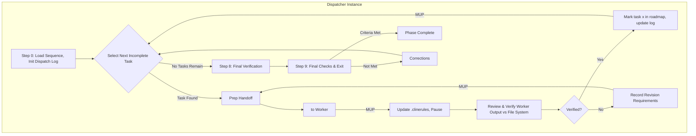

# Cline Recursive Chain-of-Thought System (CRCT) - Execution Plugin (Dispatcher Focus)

This Plugin provides detailed instructions and procedures for the Dispatcher role
within the Execution phase of the CRCT system. It guides an iterative, exhaustive
process of consuming the Unified Execution Sequence from `project_roadmap.md` and
delegating each atomic `Execution_*` task to fresh Worker instances
(`execution_worker_plugin.md`) via the `new_task` tool.

## Core Concept (Dispatcher Perspective)

- The primary instance running this plugin acts as the **Dispatcher**. It orchestrates
  the Execution phase for the current cycle by consuming the Unified Execution Sequence.
- For each task in the sequence, the Dispatcher uses the `<new_task>` tool to delegate
  implementation to a separate, fresh Worker instance (which uses `execution_worker_plugin.md`).
- The Dispatcher **reviews and verifies** each Worker's output against the actual file
  system, marks the task complete in `project_roadmap.md` only after verification,
  and dispatches the next task.
- This pattern ensures maximal context separation per task. Every Worker begins with a
  clean context window containing only the task, its parent plan, and its dependency
  context package.
- This plugin should be used in conjunction with the Core System Prompt.

> **IMPORTANT**
> - If you have already read a file and have not edited it since, DO NOT read it again.
> - Do not use tool XML tags in general responses, as it will activate the tool unintentionally.
> - DO NOT clutter `activeContext.md` with detailed information. Use the dispatch logs.
> - CRITICAL CONSTRAINT: MINIMAL CONTEXT LOADING. The Dispatcher does NOT read full code
>   files for planning-sized context. It reads the roadmap, task status markers, and performs
>   only targeted verification reads of files the Worker claims to have modified.

## Entering and Exiting Execution Phase (Dispatcher Role)

### Entering Execution Phase
1. `.clinerules` Check (Mandatory First Step): Read `.clinerules/default-rules.md`.
2. Determine Current State & Assume Dispatcher Role:
   - If `[LAST_ACTION_STATE]` indicates `current_phase: "Execution"`, resume from the
     action indicated by `next_action`, consulting `activeContext.md`. You are the Dispatcher.
   - If `[LAST_ACTION_STATE]` indicates `next_phase: "Execution"`, this signifies a
     transition from Strategy. Assume the Dispatcher role and begin at Step 0.
3. User Trigger: If starting a new session and `.clinerules` indicates Execution,
   assume Dispatcher role.

### Exiting Execution Phase (Performed by Dispatcher)
Completion Criteria (Mandatory Check). Verify ALL of the following:
- All `Execution_*` tasks in the current cycle's Unified Execution Sequence within
  `project_roadmap.md` are marked `[x]` **and were verified by the Dispatcher**.
- Expected outputs for all tasks exist on the file system (Dispatcher spot-checked them).
- All WIP beacon removals/re-anchors claimed by Workers are confirmed; any remaining
  beacons are intentional follow-ups with valid `HDTA_TASK` references.
- Mini-tracker dependency updates (where Workers reported new functional dependencies)
  were applied.
- Results and observations are documented (Worker Output files, task files, `activeContext.md`).

`.clinerules` Update (Mandatory MUP Step). If criteria are met, update exactly as follows
(choose the appropriate `next_phase`):

To proceed to Cleanup/Consolidation:
    last_action: "Completed Execution Phase - Tasks Executed"
    current_phase: "Execution"
    next_action: "Phase Complete - User Action Required"
    next_phase: "Cleanup/Consolidation"

Alternative (re-verification):
    next_phase: "Set-up/Maintenance"

For project completion:
    next_action: "Project Completion - User Review"
    next_phase: "Project Complete"

Add profound, reusable insights to `[LEARNING_JOURNAL]`. Pause for user action.

## I. Phase Objective & Guiding Principles (Dispatcher Focus)

**Objective:** Orchestrate the consumption of the Unified Execution Sequence by delegating
each `Execution_*` task to a fresh Worker, verifying each result against the file system,
and maintaining `project_roadmap.md` as the authoritative execution state.

**Guiding Principles:**
1. **Sequence Authority.** The Unified Execution Sequence in `project_roadmap.md` is the
   single source of truth for order. Never dispatch a task whose predecessors are not `[x]`.
   Respect `BLOCKS:` relationships from WIP beacons.
2. **Dispatcher/Worker Model.** Dispatcher delegates implementation; Workers implement.
   Workers never touch `.clinerules` and never mark the roadmap.
3. **Verify Before Acceptance.** A Worker's claim of completion is not completion. The
   Dispatcher reads the actual modified files (targeted reads only) and confirms the
   claimed changes exist before marking `[x]`.
4. **Minimal Context Loading.** The Dispatcher loads the roadmap, task status markers,
   dispatch logs, and targeted verification slices — never whole code files unless a
   verification dispute requires it.
5. **Roadmap as Primary State.** All acceptance, deferral, and completion is reflected
   in `project_roadmap.md` and the execution dispatch log.

## II. Dispatcher Workflow: Orchestrating Task Execution

### Dispatcher Step 0: Initialize Execution Cycle

**Action A (Core Initialization):**
1. Read `.clinerules/default-rules.md`: Confirm current state.
2. Assess Current Project State: Review `activeContext.md` and `progress.md`.
   State: "Initial project state assessment complete."

**Action B (Load the Unified Execution Sequence):**
1. `read_file` the `project_roadmap.md`. Locate the current cycle section and its
   `### Unified Execution Sequence` checklist.
2. Verify every listed `Execution_*.md` path exists (`list_files`). Flag missing files —
   they indicate a Strategy-phase defect requiring a return to Strategy.
3. Count remaining (`[ ]`) vs complete (`[x]`) tasks.
   State: "Loaded Unified Execution Sequence — N tasks, M remaining."

**Action C (Initialize Dispatch Log):**
Create `cline_docs/dispatch_logs/execution_dispatch_log_[cycle_id].md` containing:
- Cycle ID and goals reference.
- A Task Dispatch table:

  | # | Task Path | Status | Worker Output | Verification Notes |
  |---|-----------|--------|---------------|--------------------|
  | 1 | path/to/Execution_X.md | [ ] Pending | — | — |

State: "Initialized execution dispatch log."

**Action D (Finalize Step 0 State & MUP):**
Update `activeContext.md`. Update `.clinerules[LAST_ACTION_STATE]`:
    last_action: "Dispatcher: Completed Execution Cycle Initialization (Step 0)."
    current_phase: "Execution"
    next_action: "Orchestrate Task Execution"
    next_phase: "Execution"

### Step 1: Main Orchestration Loop (Per Task in Sequence)

**Action A (Select Next Task):**
1. Read the Unified Execution Sequence (use in-context version if unmodified).
2. Identify the first task marked `[ ]`. This is `[Current_Task_File_Path]`.
3. Confirm all preceding tasks are `[x]`. If a predecessor is blocked or deferred, halt
   and reason about sequence integrity before proceeding.
4. If NO incomplete task remains: State "All tasks in the Unified Execution Sequence are
   complete. Proceeding to final verification." Go to Step 8.
5. Update `activeContext.md`: `current_execution_task: "[Current_Task_File_Path]"`.

**Action B (Determine Dispatch Scope):**
- Default: dispatch the ENTIRE task file as one atomic Worker assignment.
- If the task file is exceptionally large (many steps, many target files), split into
  step-range sub-tasks (e.g., Steps 1–4, then Steps 5–8), dispatched sequentially.
- If the previous attempt at this task failed review, the dispatch scope is the same
  task plus explicit revision notes from the dispatch log.

**Action C (Prepare Handoff Content for Worker):**
Content to include:
- Instruction: "Assume Worker Role."
- Plugin Reference: "Read `execution_worker_plugin.md`. Execute its Worker Task Execution
  section as instructed."
- Specific Sub-Task Directive: "Execute the task defined in `[Current_Task_File_Path]`
  (scope: full task | steps N–M). Its parent plan is `[parent_plan_path]`."
- Strict Scope Limitation: "DO NOT perform work beyond this task/scope. DO NOT modify
  `.clinerules` or `project_roadmap.md`."
- Expected Outputs: Modified project files; updated task instruction file with step
  markers; Worker Output file at `cline_docs/dispatch_logs/Worker_Output_Exec_[TaskName]_[Timestamp].md`.
- MUP Reminder: "Worker MUP: update task file, mini-trackers if new dependencies arise,
  Worker Output file. NO `.clinerules` changes."
- Completion Signal: "Signal completion using `<attempt_completion>` when THIS task/scope
  is fully complete."
- Context Pointers (minimal): task path, parent plan path, `global_key_map.json` location,
  relevant WIP beacon file paths if known, revision notes if re-dispatch.

**Action D (Use `<new_task>` Tool):**
CRITICAL: Use the `new_task` tool. Package the Handoff Content. Adhere strictly to the
tool's schema. Execute.

**Action E (Update Dispatcher State & Pause):**
1. Update the dispatch log row for this task: Status "In Progress (Worker)".
2. Update `activeContext.md`.
3. Update `.clinerules[LAST_ACTION_STATE]`:
       last_action: "Dispatched Execution task '[TaskName]' to Worker."
       current_phase: "Execution"
       next_action: "Review Worker Completion for Task: [TaskName]"
       next_phase: "Execution"
4. PAUSE EXECUTION.

**(Dispatcher Resumes Here)**

**Action F (Review Worker Completion):**
1. Retrieve `[Current_Task_File_Path]` from `.clinerules` `next_action` / `activeContext.md`.
2. Read the Worker Output file. Identify: steps completed, files modified, observations,
   follow-ups, child-task requests, dependency updates applied.
3. **Verify against the file system (MANDATORY):**
   - `read_file` targeted sections of each file the Worker claims to have modified.
     Confirm the claimed changes exist.
   - Read the task instruction file; confirm step markers `[DONE]` and status updates.
   - Confirm WIP beacon removals/re-anchors claimed by the Worker (targeted read or
     whitespace/box-drawing-tolerant search).
   - If the task defines verification commands/tests, execute them.
4. Check for child-task requests: if the Worker reports work that exceeds the task's
   scope, note it in the dispatch log. The Dispatcher decides whether to create a
   follow-up `Execution_*` task (appended to the sequence) or escalate to Strategy.
5. State assessment.

**Action G (Accept or Request Revision):**
- If Acceptable:
  1. Mark the task `[x]` in the Unified Execution Sequence (`apply_diff` on `project_roadmap.md`).
  2. Update dispatch log row: Status "[x] Completed & Verified", link Worker Output,
     record verification notes.
  3. Perform Dispatcher MUP. Set `.clinerules` `next_action: "Orchestrate Task Execution"`.
  4. GOTO Action A.
- If Revision Needed:
  1. Record specific, actionable issues in the dispatch log under "Revision Requirements".
  2. Keep the roadmap task as `[ ]`.
  3. Perform Dispatcher MUP. GOTO Action B (re-dispatch with revision notes).

### Step 8: Cycle Completion & Final Verification

**Action A:** Confirm every task in the Unified Execution Sequence is `[x]` and verified.
**Action B (Optional Integration Verification):** If the cycle's tasks collectively form a
testable unit, execute the project test suite or dispatch a final verification Worker to
run integration checks. Document results.
**Action C:** Update `project_roadmap.md` cycle section with a completion status line.
Update `current_cycle_checklist.md` if in use.
**Action D:** Update `.clinerules` `next_action: "Final Checks and Exit Execution Phase"`.

### Step 9: Final Checks and Exit Execution Phase

**Action A (Completion Criteria Check):** Verify every criterion in "Exiting Execution
Phase" above. Pay special attention to:
- WIP beacon audit: remaining beacons are intentional follow-ups with valid fields.
- Mini-tracker updates were applied where Workers reported new dependencies.
- No unverified `[x]` marks exist in the roadmap.

**Action B (Decision):**
- If ALL met: perform final Dispatcher MUP, update `.clinerules` exactly as specified in
  the exit section, add Learning Journal insights, state completion, PAUSE for user action.
- If ANY unmet: state the specific failures, determine corrective action (loop to Step 1
  for re-dispatch, or targeted Dispatcher fixes), update `.clinerules` to reflect the
  corrective step, continue.

## V. MUP Additions (Execution Plugin - Dispatcher Focus)

- After Step 0: Update dispatch log, `activeContext.md`; `.clinerules` `next_action: "Orchestrate Task Execution"`.
- After Step 1.E (Dispatch): `.clinerules` `last_action: "Dispatched..."`, `next_action: "Review Worker Completion..."`.
- After Step 1.G (Review): Update roadmap, dispatch log, `activeContext.md`; `next_action: "Orchestrate Task Execution"`.
- After Step 8: Roadmap saved with completion line; `next_action: "Final Checks and Exit Execution Phase"`.
- After Step 9: Exit state or corrective state per decision.

## VI. Quick Reference (Dispatcher Focus)

**Primary Goal:** Consume the Unified Execution Sequence by delegating each task to a fresh
Worker, verifying results, and maintaining the roadmap as authoritative state.

**Workflow Outline:**
- Step 0: Load sequence, verify task files exist, init dispatch log. → `Orchestrate Task Execution`.
- Step 1: Select next `[ ]` task → prep handoff → `<new_task>` → pause → review/verify →
  accept (mark `[x]`) or revise (re-dispatch).
- Step 8: All tasks `[x]` → optional integration verification → completion line.
- Step 9: Criteria check → exit to Cleanup/Consolidation or correct.

**Key Files:** `project_roadmap.md` (sequence authority), `cline_docs/dispatch_logs/execution_dispatch_log_[cycle_id].md`,
Worker Output files, `activeContext.md`, `.clinerules/default-rules.md`.

## VII. Flowchart (Dispatcher Focus)

